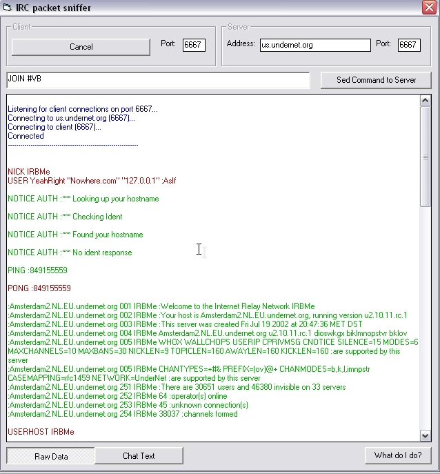



## IRC data spy

### Description

This will monitor all data being sent between an IRC client and server. Just run the program, press listen, then in IRC type /server 127.0.0.1 (6667) And it should work. Great if you want to write an IRC client/server/bot. I tried to comment the code a little. Its pretty easy code too, most of it is just UI stuff.
 
### More Info
 

             |
---                |---
**Submitted On**   |2002-07-20 14:32:26
**By**             |[IRBMe](https://github.com/Planet-Source-Code/PSCIndex/blob/master/ByAuthor/irbme.md)
**Level**          |Intermediate
**User Rating**    |5.0 (15 globes from 3 users)
**Compatibility**  |VB 5\.0, VB 6\.0
**Category**       |[Internet/ HTML](https://github.com/Planet-Source-Code/PSCIndex/blob/master/ByCategory/internet-html__1-34.md)
**World**          |[Visual Basic](https://github.com/Planet-Source-Code/PSCIndex/blob/master/ByWorld/visual-basic.md)
**Archive File**   |[IRC\_data\_s1086057202002\.zip](https://github.com/Planet-Source-Code/irbme-irc-data-spy__1-37105/archive/master.zip)

